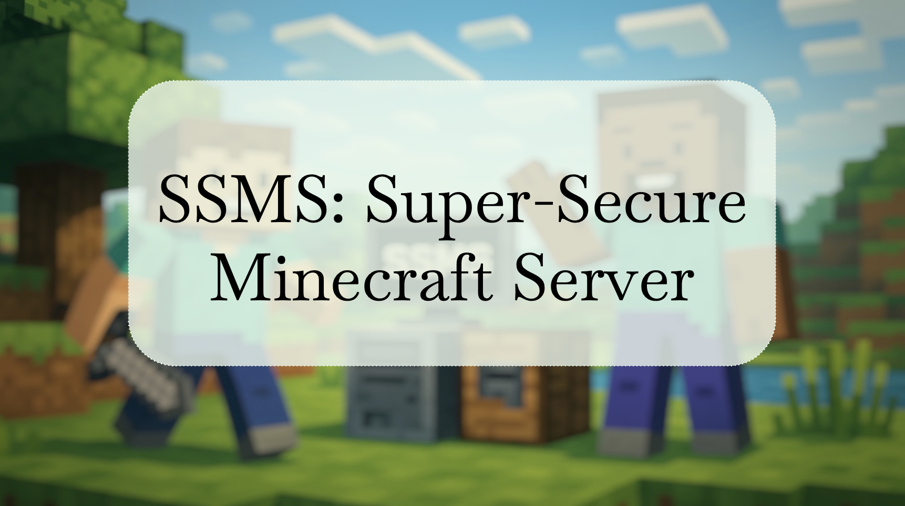

# SSMS: Super Secure Minecraft Server

This is the final project of the course Computer Network Laboratory.

For more detailed configuration, please reference our [SSMS document](https://hackmd.io/awpkVqc2TBeIHUVfc2qcyQ?view).

## File Structure
```
├── backend/  
│    # codes for web backend (FastAPI + SQLite)
├── frontend/
│    # codes for web frontend (React from Vite)
├── ldap/
│    # scripts and config file for ldap
└── mcserver_utils/
     # scripts for remote SSMS control
```


## Usage Guide
To setup the system, follow the guideline in the [SSMS document](https://hackmd.io/awpkVqc2TBeIHUVfc2qcyQ?view).

To run the Web-UI, simply run:
```
# frontend
cd frontend/reactCnlabMC
npm run dev -- --host 0.0.0.0

# backend
uvicorn app.main:app --reload --host 0.0.0.0
```
The frontend will run at port 5173, and the backend at 8000. We will use nginx as a reverse proxy to forward requests to port 80.

Then the Web UI can be access at http://admin.cnlab.
